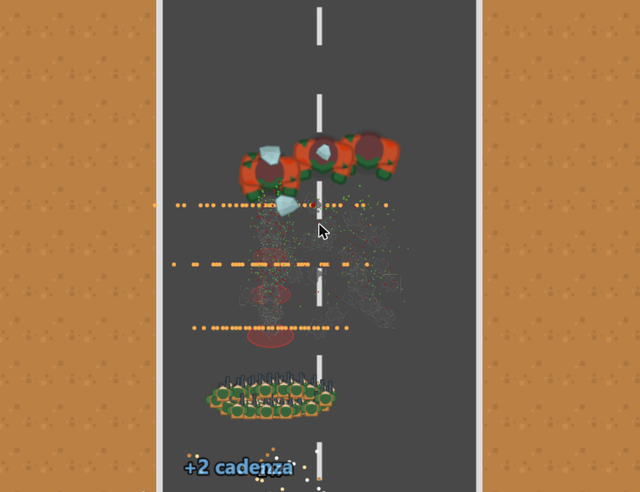

# Horde Runner

**▶ Gioca ora: https://nispa.github.io/horde-runner/**

Un gioco d'azione in stile "pubblicità mobile": guidi una squadra di soldati lungo una strada,
scegli le porte giuste, abbatti casse per ottenere bonus, raccogli armi e sopravvivi a orde di
zombi, bruti che lanciano rocce e un boss a fine livello. Si gioca nel browser, da computer o
da telefono, e si può installare come app (anche offline).



## Come si gioca

- **Muovi la squadra** a destra e a sinistra: mouse, dito sullo schermo, oppure frecce / A-D.
  La squadra avanza e spara da sola.
- **Porte (gate)**: blu = bonus, rosse = malus (`+6`, `×2`, `-10`, `÷2`…). Conta il lato in cui passi.
- **Casse**: se le abbatti sparando danno soldati ⚡ cadenza o 💥 danno; se ci sbatti contro perdi soldati.
- **Armi** sulla strada: ⚡ Mitragliatrice, 💥 Fucile a pompa, 🚀 Lanciarazzi.
- **Nemici**: gli zombi ti inseguono, i bruti rossi lanciano rocce (spostati dal cerchio rosso!),
  i boss lanciano zombi, massi e corvi.
- **Boss**: a fine livello la squadra si ferma e lo affronta. Abbattilo prima che ti raggiunga.
- **Punteggio e classifica** in stile sala giochi: entra nella top 10 e lascia le tue iniziali.
- Tasto **M** o 🔊 per il muto. Su telefono: menu del browser → "Aggiungi a schermata Home".

Cinque livelli (Periferia, Campagna, Zona industriale, Deserto, Passo innevato), sbloccabili in sequenza.

## Tecnologie

TypeScript · [Phaser 4](https://phaser.io) · [Vite](https://vite.dev) · [Vitest](https://vitest.dev) ·
PWA con [vite-plugin-pwa](https://vite-pwa-org.netlify.app) · GitHub Actions + GitHub Pages.

La logica del gioco è separata dalla grafica (cartella `src/core`), così potrà essere riutilizzata
con altri motori (Three.js, Unity, Unreal).

## Per sviluppatori

```bash
npm install
npm run dev      # http://localhost:5173
npm test         # test della logica e del bilanciamento
npm run build    # versione di produzione in dist/
```

Ogni push su `master` pubblica automaticamente il gioco su GitHub Pages.

## Documentazione

- 📘 **[Manuale didattico](docs/MANUALE.md)** — come è stato fatto il gioco: idea, architettura,
  tecnologie, meccaniche, bilanciamento con i bot, pubblicazione, risorse usate.
- [AGENTS.md](AGENTS.md) — guida tecnica per chi riprende lo sviluppo.
- [PLANNING.md](PLANNING.md) — stato del progetto, decisioni prese e prossimi passi.

## Crediti e licenze

- Grafica e suoni: [Kenney.nl](https://kenney.nl) — pacchetti *Top-down Shooter*, *Impact Sounds*,
  *Interface Sounds*, *Sci-fi Sounds*, *Music Jingles* (licenza **CC0**, pubblico dominio).
- Font: [Press Start 2P](https://fonts.google.com/specimen/Press+Start+2P) di CodeMan38 (licenza **SIL OFL 1.1**).
- Codice sviluppato con l'assistenza di [Claude Code](https://claude.com/claude-code).
